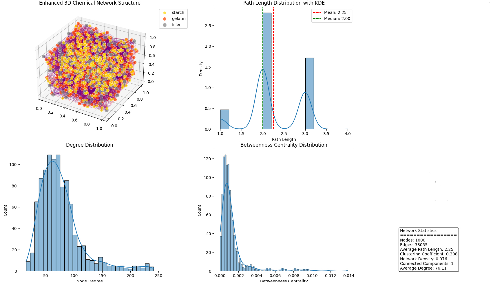

# Biopolymer Inner Structure Analysis using Graph Theory

> Master's Thesis Project — Modelling the molecular network of a gelatin-starch biopolymer composite using graph-theoretic methods.

---

## Problem

Biopolymer composites — materials made from natural polymers like gelatin and starch — have complex inner molecular structures that directly influence their mechanical and physical properties. Understanding how the network forms, where it is dense or sparse, and how fillers disrupt it is key to designing better bio-based materials.

This project takes a **computational graph theory approach**: represent the polymer as a network and extract structural descriptors mathematically.

---

## Composite Material

| Component | Role | Amount |
|---|---|---|
| Gelatin | Protein matrix polymer | 46 g |
| Starch | Polysaccharide (amylopectin-like) | 36 g |
| Calcium carbonate (CaCO₃) | Inorganic filler (stone powder) | 18 g |
| Acetic acid | Crosslink modifier (vinegar) | 34 mL |

---

## Approach

The composite is modelled as an undirected graph where **nodes** are individual monomer units and **edges** are chemical bonds.

| Bond | Between | Chemical basis |
|---|---|---|
| Hydrogen | Gelatin ↔ Starch | NH / C=O ··· OH interactions |
| Glycosidic | Starch ↔ Starch | Alpha-1,6 branch points (amylopectin) |
| Ionic | CaCO₃ ↔ Polymer | Ca²⁺ coordination with carboxylate groups |
| Protonation | Acetic acid ↔ Polymer | OH group protonation |

The network is assembled and analysed using **NetworkX**, with bond formation determined by stochastic spatial proximity between monomer units.

---

## Results

| Metric | Value |
|---|---|
| Nodes | 1000 |
| Edges | 38,055 |
| Connected components | 1 |
| Average degree | 76.11 |
| Network density | 0.076 |
| Clustering coefficient | 0.308 |
| Average path length | 2.25 hops |

**Key observations:**
- The network forms a **single connected component** — the polymer backbone is fully intact with no isolated clusters, indicating a well-crosslinked composite structure.
- An average path length of **2.25 hops** reflects small-world behaviour: any two monomers in the network are reachable within approximately 2 bond steps, consistent with a dense crosslinked gel.
- The clustering coefficient of **0.308** indicates moderate local bonding density, suggesting regions of tightly bonded monomers coexist with more loosely connected areas — likely corresponding to amorphous vs. ordered domains in the real material.

---

## Tech Stack

| Library | Purpose |
|---|---|
| [NetworkX](https://networkx.org/) | Graph construction and analysis |
| [NumPy](https://numpy.org/) | Numerical operations |
| [Matplotlib](https://matplotlib.org/) | Visualisation |
| [Seaborn](https://seaborn.pydata.org/) | Statistical plotting |

---

## Graph Theory Concepts Applied

- **Degree distribution** — reveals hub monomers with unusually high connectivity
- **Path length distribution** — measures small-world character of the network
- **Clustering coefficient** — quantifies local bond density
- **Betweenness centrality** — identifies critical bridge nodes whose removal would fragment the network
- **Connected components** — detects isolated clusters vs. the main polymer backbone

---

## Author

**Nafis Yousefi Rad**
Master's Thesis — Pars University, 2024-2025
[Email](nafis.yrad@email.com)
