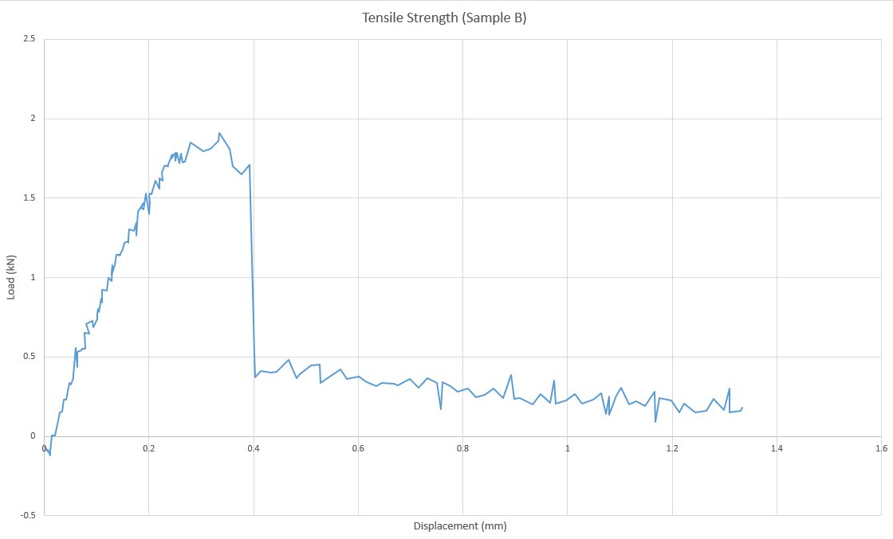
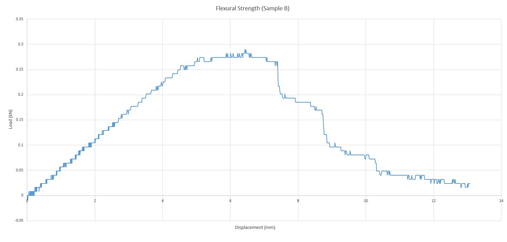

# Experimental Validation — Mechanical Testing

The computational network model was physically validated through mechanical testing
of fabricated biopolymer composite samples using an **Instron 8502** universal
testing machine. Both tensile and flexural strength were characterised to understand
how the molecular network structure relates to macroscopic mechanical behaviour.

---

## Composite Composition (Sample B)

| Component | Amount |
|---|---|
| Gelatin | 46 g |
| Starch | 36 g |
| Calcium carbonate (CaCO₃) | 18 g |
| Acetic acid (vinegar) | 34 mL |

---

## Tensile Strength

| Parameter | Value |
|---|---|
| Peak load | ~1.90 kN |
| Displacement at failure | ~0.35 mm |
| Failure mode | Brittle fracture |

**Interpretation:**
The material exhibits a well-defined elastic region up to approximately 0.20 mm
displacement, beyond which it reaches its ultimate tensile strength of ~1.90 kN.
The sharp vertical load drop at 0.35 mm is characteristic of brittle fracture —
the material fails suddenly without significant plastic deformation. This behaviour
is consistent with the network model: the CaCO₃ filler increases stiffness by
forming ionic interactions with the polymer chains, but simultaneously reduces
ductility by disrupting the continuity of the gelatin-starch hydrogen bond network.

---

## Flexural Strength

| Parameter | Value |
|---|---|
| Peak load | ~0.30 kN |
| Displacement at peak | ~7.50 mm |
| Failure mode | Semi-ductile |

**Interpretation:**
Under bending, the material demonstrates markedly different behaviour compared
to direct tension. The extended elastic region (0–4 mm) and broad plateau
(4–7.5 mm) indicate that the composite can redistribute bending stress across
its cross-section before failing. The gradual post-peak decline further confirms
semi-ductile behaviour in flexure. Peak flexural load (~0.30 kN) is significantly
lower than tensile peak (~1.90 kN), consistent with standard material mechanics.

---

## Tensile vs. Flexural — Key Comparison

| Property | Tensile | Flexural |
|---|---|---|
| Peak load | 1.90 kN | 0.30 kN |
| Displacement at failure | 0.35 mm | 7.50 mm |
| Failure character | Brittle | Semi-ductile |
| Energy absorbed | Low | High |

The contrast between brittle tensile failure and semi-ductile flexural behaviour
is the most significant finding. It suggests that the gelatin-starch matrix,
while capable of distributing bending loads through its hydrogen bond network,
lacks the continuous chain connectivity needed to resist direct tensile pull —
a finding that is directly supported by the graph model, where CaCO₃-induced
bond disruption reduces the tensile load path continuity across the network.

---

## Connection to the Computational Model

The graph-theoretic analysis showed:
- A **single connected component** — the network backbone is intact
- **Average path length of 2.25 hops** — dense, highly crosslinked structure
- **Clustering coefficient of 0.308** — moderate local bonding density with variation

The mechanical results are consistent with these findings: a well-connected
network (single component, short path lengths) produces a stiff material capable
of bearing significant load, while the moderate clustering coefficient reflects
the heterogeneous bonding density that explains the difference in tensile vs.
flexural behaviour.

---

## Equipment

- **Machine:** Instron 8502 Universal Testing Machine
- **Test standard:** Three-point bending (flexural) / uniaxial tension
- **Sample:** Biopolymer composite — Sample B
